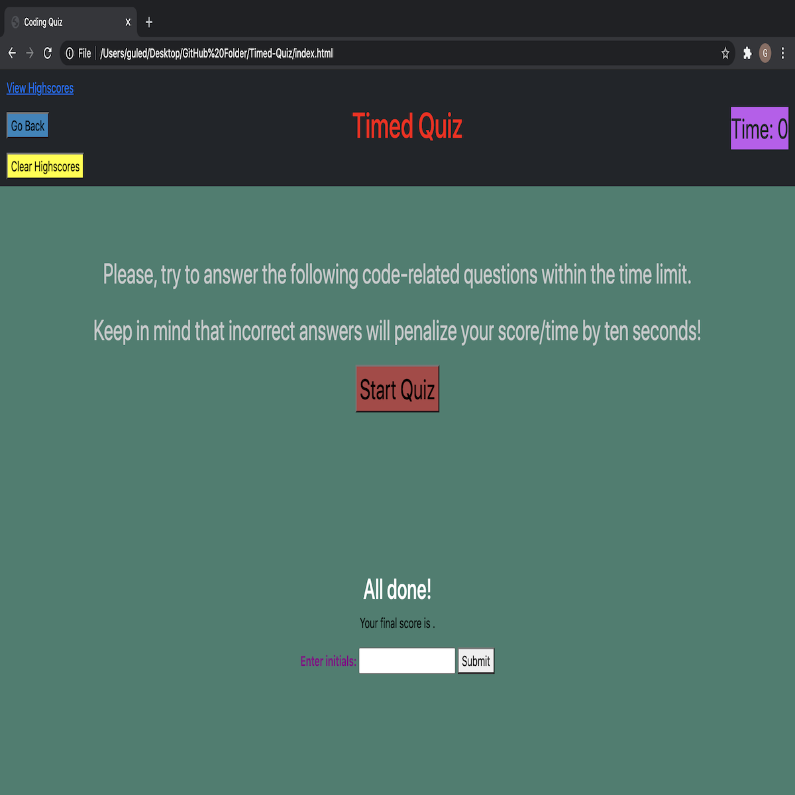

<h1> INTRODUCTION</h1>

 
Website Link : <a href="https://guled06.github.io/Timed-Quiz/">Timed Quiz</a>
 

This timed quiz application has multiple-choice questions. This app will run in the browser and it will feature dynamically updated HTML and CSS powered by Javascript codes. This application was designed to have a simple and responsive user interface.

 
<h1>DESCRIPTION</h1>

 

This application was designed to let users take a timed quiz. In the timed quiz, this application should ideally store the scores of each user in localstorage. This was the idea, so that the user can gauge his progress compared to previous users who have taken the timed quiz.

 
<h1>My Background</h1>

 

This was my second time in working with Javascript during my experience at the UCSD Triology Coding Bootcamp. This was a homework assignment designed for each student to complete the homework assignment on his/her own, with the help of his/her tutor and other resources that are available. You can review my previous Javascript application that I completed <a href="https://guled06.github.io/Password-Generator/">HERE</a>. In my previous project/assignment, I designed an application that allowed the user to generate a random password using lowercase and uppercase letter, numbers and special characters.

<h1>Overall Application</h1>

 

I built this application was HTML. Within my HTML, I used <a href="https://getbootstrap.com/docs/4.5/components/alerts/">Bootstrap</a> to assist me with styling the HTML. I also used my own CSS styling and linked both styles to my HTML page.

<h1>SCREENSHOT OF MY TIMED-QUIZ APPLICATION</h1>

 
 

